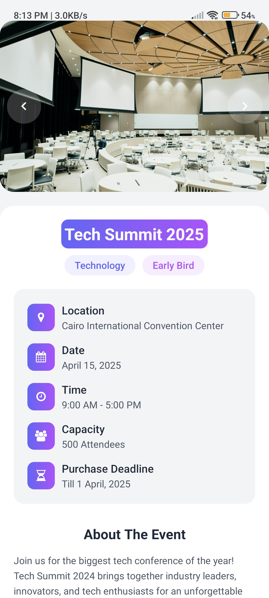
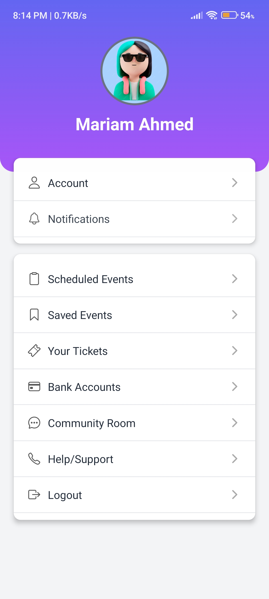
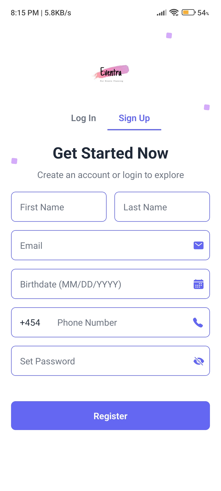

# Eventra Mobile

A modern React Native mobile application for discovering, booking, and managing events and services.

## 🌟 Features

- **Event Discovery**: Browse and search through various events
- **Service Booking**: Book different services like venues, photographers, and more
- **User Authentication**: Secure login and registration system
- **Payment Integration**: Secure payment processing with PayPal
- **Event Management**: Save events and track your bookings
- **Real-time Notifications**: Stay updated with event notifications
- **User Dashboard**: Manage your profile and preferences

## 🚀 Technologies Used

- React Native
- Expo
- Redux Toolkit
- React Navigation
- Expo Linear Gradient
- Lottie React Native
- React Native Vector Icons
- React Native WebView
- React Native Toast Message

## 📱 Screenshots










## 🛠️ Installation

1. Clone the repository
```bash
git clone https://github.com/ibrahimqudry/Eventra_Mobile.git
cd Eventra_Mobile
```

2. Install dependencies
```bash
npm install
```

3. Start the development server:
```bash
npm start  
```

## 📦 Project Structure

eventra_mobile/
├── assets/           # Images, fonts, and other static assets
├── redux/            # Redux store and slices
├── screens/          # Application screens
│   ├── EventsScreen.jsx
│   ├── HomeScreen.jsx
│   ├── Login.jsx
│   └── ...
├── App.js           # Main application component
└── package.json     # Project dependencies

## 🤝 Contributing

Contributions are welcome! Please feel free to submit a Pull Request.

##  🙏 Acknowledgments

- Thanks to all contributors and supporters of this project
- Special thanks to the React Native and Expo communities